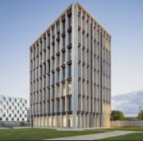
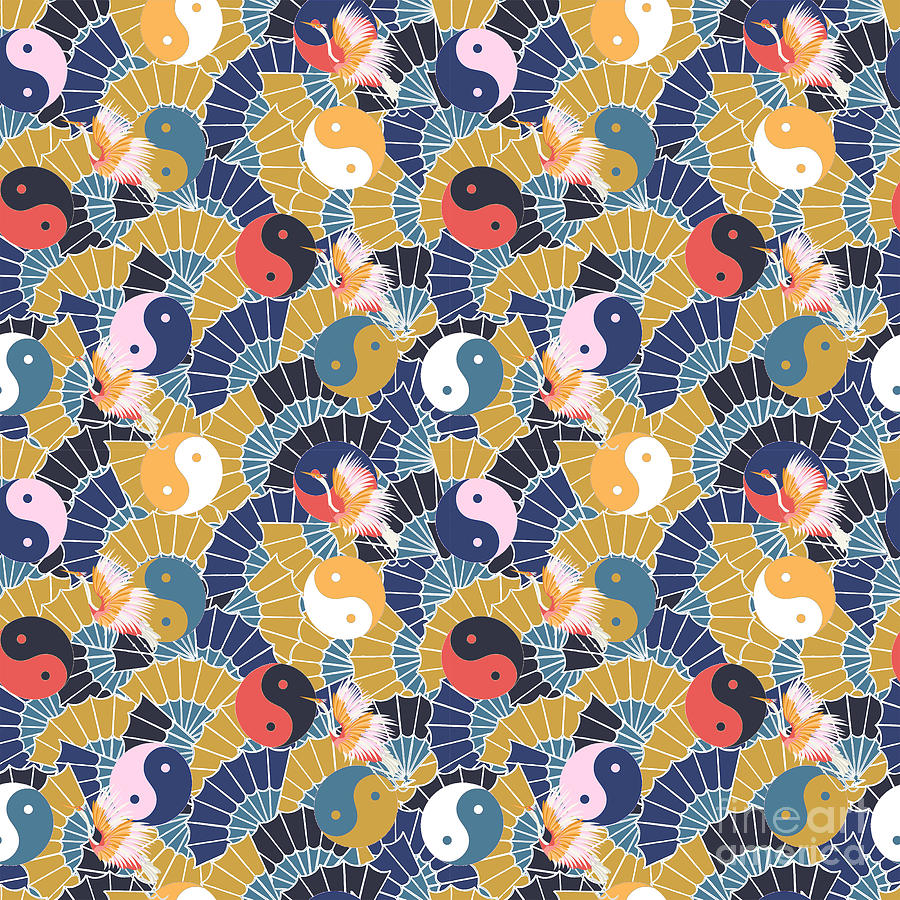
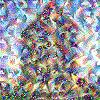

# Neural Style Transfer

## Table of Contents
1. [Introduction](#1-introduction)
    - [What is Neural Style Transfer?](#what-is-neural-style-transfer)
    - [Applications of Neural Style Transfer](#applications-of-neural-style-transfer)
2. [Theory](#2-theory)
    - [Content and Style Representations](#content-and-style-representations)
    - [Loss Functions](#loss-functions)
        - [Content Loss](#content-loss)
        - [Style Loss](#style-loss)
        - [Total Loss](#total-loss)
3. [Project Structure](#3-project-structure)
    - [Loading and Processing Images (`utils.py`)](#loading-and-processing-images-utilspy)
    - [Building the VGG Model (`neuraltransfer.py`)](#building-the-vgg-model-neuraltransferpy)
    - [Running the Script (`main.py`)](#running-the-script-mainpy)
4. [Detailed Code Explanation](#4-detailed-code-explanation)
    - [Loading and Processing Images (`utils.py`)](#loading-and-processing-images-utilspy-1)
    - [Building the VGG Model (`neuraltransfer.py`)](#building-the-vgg-model-neuraltransferpy-1)
    - [Computing the Losses (`utils.py`)](#computing-the-losses-utilspy)
    - [Running the Style Transfer (`neuraltransfer.py`)](#running-the-style-transfer-neuraltransferpy-1)
5. [Running the Script](#5-running-the-script)
6. [References](#6-references)

## 1. Introduction

### What is Neural Style Transfer?
Neural Style Transfer (NST) is a technique that takes two images—a content image and a style image—and blends them together so that the output image looks like the content image but "painted" in the style of the style image. It uses convolutional neural networks (CNNs) to achieve this effect.

### Applications of Neural Style Transfer 
- Artistic image generation
- Photo and video editing
- Creating visually appealing content for social media and marketing
 
## 2. Theory

### Content and Style Representations
To understand NST, we need to grasp how CNNs can be used to extract features from images. The VGG network, a deep CNN, is often used for this purpose. The intermediate layers of this network can be used to capture both content and style representations of an image.

### Loss Functions
The core idea of NST is to define and minimize a loss function that blends the content of one image with the style of another.

#### Content Loss
The content loss measures how different the content of the generated image is from the content image. It is typically calculated as the mean squared error (MSE) between the feature representations of the content image and the generated image at a certain layer.

```math
\mathcal{L}_{\text{content}}(C, G) = \sum_{i,j} ( F_{ij}^{C} - F_{ij}^{G} )^2
```

where $F_{ij}^{C}$ and $F_{ij}^{G}$ are the feature representations of the content image and generated image, respectively.

#### Style Loss
The style loss measures how different the style of the generated image is from the style image. It is calculated using the Gram matrix of the feature representations. The Gram matrix captures the correlations between the different feature maps.

```math
\mathcal{L}_{\text{style}}(S, G) = \sum_{l} w_{l} \sum_{i,j} ( G_{ij}^{S} - G_{ij}^{G} )^2
```

where $G_{ij}^{S}$ and $G_{ij}^{G}$ are the Gram matrices of the style image and generated image, and $w_{l}$ are the weights for each layer.

#### Total Loss
The total loss is a weighted sum of the content loss and the style loss.

```math
\mathcal{L}_{\text{total}} = \alpha \mathcal{L}_{\text{content}} + \beta \mathcal{L}_{\text{style}}
```

where $\alpha$ and $\beta$ are the weights for the content and style loss, respectively.

## 3. Project Structure
The project is divided into three main modules:

- `utils.py`: Helper functions for image loading and processing.
- `neuraltransfer.py`: Implements the Neural Style Transfer logic.
- `main.py`: The entry point for the script, handling argument parsing and running the transfer.

## 4. Detailed Code Explanation

### Loading and Processing Images (`utils.py`)
This module contains functions to load and preprocess images for the VGG model.

#### Preprocessing and Deprocessing
```python
def preprocess_image(image_path, img_size):
    img =  np.array(Image.open(image_path).resize((img_size, img_size)))
    img = tf.constant(np.reshape(img, ((1,) + img.shape)))
    return img
```

The `preprocess_image` function preprocesses the image by resizing it and reshaping it to have a batch dimension, making it compatible with the VGG model input.

### Building the VGG Model (`neuraltransfer.py`)
This module defines the VGG model and its layers for style and content extraction.

```python
def load_vgg_model(img_size):
    vgg = vgg19.VGG19(include_top=False, weights='imagenet', input_shape=(img_size, img_size, 3))
    vgg.trainable = False
    return tf.keras.Model([vgg.input], [layer.output for layer in vgg.layers])
```

This function creates a VGG model that outputs the intermediate layers specified for style and content extraction.

### Computing the Losses (`utils.py`)
The content and style loss functions are defined here.

```python
def compute_content_cost(content_output, generated_output):
    a_C = content_output[-1]
    a_G = generated_output[-1]

    _, n_H, n_W, n_C = a_G.get_shape().as_list()

    a_C_unrolled = tf.reshape(a_C, shape=[1, n_H * n_W, n_C])
    a_G_unrolled = tf.reshape(a_G, shape=[1, n_H * n_W, n_C])

    J_content = tf.reduce_sum(tf.square(a_C_unrolled - a_G_unrolled)) / (4.0 * n_H * n_W * n_C)
    return J_content
```

The `compute_content_cost` function computes the MSE between the content representations. The `gram_matrix` function computes the Gram matrix, and the `compute_style_cost` function computes the MSE between the Gram matrices of the style representations.

### Running the Style Transfer (`neuraltransfer.py`)
This module contains the main logic for running the style transfer.

#### Initialization
```python
class NeuralStyleTransfer:
    def __init__(self, content_path, style_path, output_path, iteration=200, img_size=50):
        self.content_path = content_path
        self.style_path = style_path
        self.output_path = output_path
        self.img_size = img_size
        self.iteration = iteration
        self.content_layer = [('block5_conv4', 1)]
        self.style_layer = [
            ('block1_conv1', 0.2),
            ('block2_conv1', 0.2),
            ('block3_conv1', 0.2),
            ('block4_conv1', 0.2),
            ('block5_conv1', 0.2)
        ]
        self.vgg = load_vgg_model(img_size=self.img_size)
```

This class initializes the content and style images, defines the layers for content and style extraction, and builds the VGG model.

#### Running the Optimization
```python
def run_style_transfer(self, num_iterations=1000, content_weight=1e3, style_weight=1e-2):
    self.content_image = preprocess_image(self.content_path, self.img_size)
    self.style_image = preprocess_image(self.style_path, self.img_size)

    self.model = self.build_model()

    style_features = self.model(self.style_image)
    content_features = self.model(self.content_image)

    self.style_targets = [gram_matrix(style_feature) for style_feature in style_features[:self.num_style_layers]]
    self.content_targets = content_features[self.num_content_layers:]

    init_image = tf.Variable(self.content_image, dtype=tf.float32)
    opt = tf.optimizers.Adam(learning_rate=0.02, beta_1=0.99, epsilon=1e-1)
    
    cfg = {
        'model': self.model,
        'init_image': init_image,
        'style_targets': self.style_targets,
        'content_targets': self.content_targets,
        'content_weight': content_weight,
        'style_weight': style_weight
    }

    best_loss, best_img = float('inf'), None

    for i in range(self.iteration):
        with tf.GradientTape() as tape:
            a_G = self.model(init_image)
            J_style = compute_style_cost(self.style_targets, a_G, self.style_layer)
            J_content = compute_content_cost(self.content_targets, a_G)
            J_total = total_cost(J_content, J_style)

        grads = tape.gradient(J_total, init_image)
        opt.apply_gradients([(grads, init_image)])
        clipped_image = tf.clip_by_value(init_image, -1.0, 1.0)
        init_image.assign(clipped_image)

        if J_total < best_loss:
            best_loss = J

_total
            best_img = tensor_to_image(clipped_image)

        if i % 100 == 0:
            print(f"Iteration: {i}, Loss: {J_total}")

    return best_img, best_loss
```

This function runs the style transfer optimization, updating the generated image to minimize the total loss over a specified number of iterations.

## 5. Running the Script
The `main.py` script is the entry point for running the Neural Style Transfer.

```python
import argparse
from neuraltransfer import NeuralStyleTransfer

def parse_args():
    parser = argparse.ArgumentParser(description='Neural Style Transfer')
    parser.add_argument('--content', type=str, required=True, help='Path to the content image')
    parser.add_argument('--style', type=str, required=True, help='Path to the style image')
    parser.add_argument('--output', type=str, required=True, help='Path to save the output image')
    parser.add_argument('--iteration', type=int, required=True, help='Number of iterations')
    parser.add_argument('--img_size', type=int, required=True, help='Image size')
    return parser.parse_args()

def main():
    args = parse_args()
    nst = NeuralStyleTransfer(args.content, args.style, args.output, iteration=args.iteration, img_size=args.img_size)
    nst.generate()

if __name__ == '__main__':
    main()
```

This script uses `argparse` to handle command-line arguments for specifying the paths to the content and style images, the output image path, the number of iterations, and the image size. It then creates an instance of `NeuralStyleTransfer`, runs the style transfer, and saves the generated image.

## Sample Bash Command

```bash
python main.py --content /images/content.jpg --style /images/style.jpg --output /images/output.jpg --iteration 200 --img_size 100
```

## Result

After running for 200 iterations:

<div style="display: flex; justify-content: space-between;">
    
    
    
</div>

